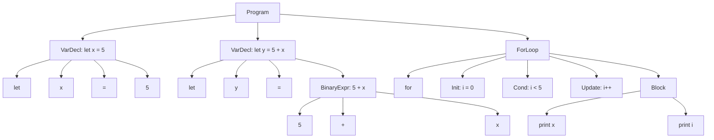

# Eidos Grammar (BNF Rules)

Now that the Lexer is done, it is time to write the grammar rules. \
These rules dictate how the language is typed, i.e. what tokens/lexemes go before/after these ones, etc, etc. \
This creates the syntax of the language. 

This is a great segmant of what Eidos really is

## 1.1 What is the goal of Eidos Grammar

For Eidos v1.0.0 it should remain simple and nothing crazy and then evolve, as mentioned in the `README`, simple now, grow in complexity but chill after a bit of development. 


## 1.1 Parse Tree

Given this example code written in Eidos: 

```bash
let x = 5;
let y = 5 + x;

for (i = 0; i < 5; i++) {
    print(x);
    print(i);
}
```

Now usually you would parse after BNF rules are created but I find that this helps me better see how the Lnaguage rules should be written. 

Below is the parse tree created by hand parsing.



## 1.2 Grammar 

The next step, given a parse tree is to try to write out some BNF Rules.

The top level of any code is the `<program>`. This is the main entry point of the recursive decent parser. The `<program>` consists of `<statements>` or `<stmts>` and a singler `<stmt>` is what makes up `<stmts>`

As of now our BNF Grammar looks like this: 

```bash
<program> ::= <stmts>
<stmts>   ::= <stmt>; <stmts>; | <stmt>;
```

Now things will get a little more nuanced as there are different tyoes of statements in a programming language. Are the ones for Eidos.


```bash
<stmt> ::= <var_decl>
         | <assignment_stmt>  
         | <if_stmt>
         | <loop_stmt>
         | <io_stmt>
```


So far: 

```bash
<program> ::= <stmts>
<stmts>   ::= <stmt> <stmts> | ε

<stmt> ::= <var_decl>
         | <assignment_stmt>  
         | <if_stmt>
         | <loop_stmt>
         | <io_stmt>
         | <inc_dec_stmt>

<var_decl> ::= 'let' IDENTIFIER '=' <expr> ';'

<assignment_stmt> ::= IDENTIFIER '=' <expr> ';'

<if_stmt> ::= 'if' '(' <conditional> ')' '{' <stmts> '}'
            | 'if' '(' <conditional> ')' '{' <stmts> '}' 'else' '{' <stmts> '}'

<loop_stmt> ::= 'while' '(' <conditional> ')' '{' <stmts> '}' 
              | 'for' '(' <assignment_stmt> <conditional> ';' <inc_dec_stmt> ')' '{' <stmts> '}'


<io_stmt> ::= 'print' '(' <expr> ')' ';'
            | 'read' '(' IDENTIFIER ')' ';'

<inc_dec_stmt> ::= IDENTIFIER '++' ';'
                 | IDENTIFIER '--' ';'
                 | '++' IDENTIFIER ';'
                 | '--' IDENTIFIER ';'

<conditional> ::= <expr> COMPARISON_OP <expr>

<expr> ::= <expr> '+' <term> | <expr> '-' <term> | <term>
<term> ::= <term> '*' <factor> | <term> '/' <factor> | <factor>
<factor> ::= '(' <expr> ')' | IDENTIFIER | NUMBER

COMPARISON_OP ::= '==' | '!=' | '<' | '>' | '<=' | '>='
```


