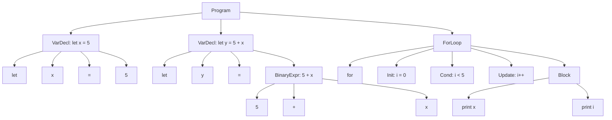

# Eidos Grammar (BNF Rules)

Now that the Lexer is done, it is time to write the grammar rules. \
These rules dictate how the language is typed, i.e. what tokens/lexemes go before/after these ones, etc, etc. \
This creates the syntax of the language. 

This is a great segmant of what Eidos really is

## 1.1 What is the goal of Eidos Grammar

For Eidos v1.0.0 it should remain simple and nothing crazy and then evolve, as mentioned in the `README`, simple now, grow in complexity but chill after a bit of development. 


## 1.1 Parse Tree

Given this example code written in Eidos: 

```bash
let x = 5;
let y = 5 + x;

for (i = 0; i < 5; i++) {
    print(x);
    print(i);
}
```

Now usually you would parse after BNF rules are created but I find that this helps me better see how the Lnaguage rules should be written. 

Below is the parse tree created by hand parsing (for a recursive decent parser).



## 1.2 Grammar 

The next step, given a parse tree is to try to write out some BNF Rules.

The top level of any code is the `<program>`. This is the main entry point of the recursive decent parser. The `<program>` consists of `<statements>` or `<stmts>` and a singler `<stmt>` is what makes up `<stmts>`

As of now our BNF Grammar looks like this: 

```bash
<program> ::= <stmts>
<stmts>   ::= <stmt>; <stmts>; | <stmt>;
```

Now things will get a little more nuanced as there are different tyoes of statements in a programming language. Are the ones for Eidos.


```bash
<stmt> ::= <var_decl>
         | <assignment_stmt>  
         | <if_stmt>
         | <loop_stmt>
         | <io_stmt>
```


So far: 

```bash
<program> ::= <stmts>
<stmts>   ::= <stmt> <stmts> | ε

<stmt> ::= <var_decl>
         | <assignment_stmt>  
         | <if_stmt>
         | <loop_stmt>
         | <io_stmt>
         | <inc_dec_stmt>

<var_decl> ::= 'let' IDENTIFIER '=' <expr> ';'

<assignment_stmt> ::= IDENTIFIER '=' <expr> ';'

<if_stmt> ::= 'if' '(' <conditional> ')' '{' <stmts> '}'
            | 'if' '(' <conditional> ')' '{' <stmts> '}' 'else' '{' <stmts> '}'

<loop_stmt> ::= 'while' '(' <conditional> ')' '{' <stmts> '}' 
              | 'for' '(' <assignment_stmt> <conditional> ';' <inc_dec_stmt> ')' '{' <stmts> '}'


<io_stmt> ::= 'print' '(' <expr> ')' ';'
            | 'read' '(' IDENTIFIER ')' ';'

<inc_dec_stmt> ::= IDENTIFIER '++' ';'
                 | IDENTIFIER '--' ';'
                 | '++' IDENTIFIER ';'
                 | '--' IDENTIFIER ';'

<conditional> ::= <expr> COMPARISON_OP <expr>

<expr> ::= <expr> '+' <term> | <expr> '-' <term> | <term>
<term> ::= <term> '*' <factor> | <term> '/' <factor> | <factor>
<factor> ::= '(' <expr> ')' | IDENTIFIER | NUMBER

COMPARISON_OP ::= '==' | '!=' | '<' | '>' | '<=' | '>='
```


## 1.3 The Language 

This language will be simple and I want to talk about how the code will be written. From assignment statements to expressions to if statements.

Also, just to note, for v1.0.0 does not allow comments, I just use them to make a point or show something. They'll be implemented later just not now.

### 1.3.1 Variable and Declaration Statements

To declare a variable you MUST assign an expression to the variable:

example:

```
let x = 2 + 4 - y;
```

Under these syntax rules this is valid, you just cant do this:
```
let x;
```

Let `x` what? Equal something? Equal what? My fucking balls? Yeah, I know in some languages you can do that but no, not here, not with Eidos.

Assignment or Reassignment statements are similar but the variable must already exist(duh), just not started with the `let` keyword.

example:
```
let x = 5;
let y = 32;

x = 4;      // see how let isn't here for assignment
y = 235;    // same here
```

Valid. But lets look here:

```
let x = 5;
let y = 645;

let x = 43;     // incorrect
let y = 65;     // incorrect
```

### 1.3.2 If-Statements

If statements are pretty standard. You got your condition wrapped in parentheses, followed by a block of code wrapped in curly braces. Simple.

example:
```
let x = 10;

if (x > 5) {
    print(x);
}
```

Valid. The condition MUST be wrapped in `()` and the body MUST be wrapped in `{}`. No single-line if statements without braces. I'm not playing those games where you accidentally add a second statement and wonder why your code is broken at 2 AM.

You can also have an else block:

```
let x = 3;

if (x > 5) {
    print(x);
} else {
    print(0);
}
```

Also valid. The `else` keyword comes right after the closing brace of the if block, followed by its own set of curly braces.

What you CAN'T do:

```
if x > 5 {      // Missing parentheses around condition
    print(x);
}

if (x > 5)      // Missing braces around body
    print(x);

if (x > 5) {
    print(x);
}
else {          // 'else' on a new line is fine, but no semicolons between blocks
    print(0);
};              // No semicolon after the if statement block
```

Remember: if statements and loops don't end with semicolons because they use block statements with curly braces. The braces ARE the delimiters.

### 1.3.3 Loops

Eidos supports two types of loops: `while` and `for`. Both require conditions in parentheses and bodies in curly braces.

#### While Loops

While loops are straightforward. Condition in parens, body in braces, keep looping while condition is true.

example:
```
let i = 0;

while (i < 10) {
    print(i);
    i++;
}
```

Valid. The loop will execute as long as `i < 10` evaluates to true.

#### For Loops

For loops are a bit more structured. You've got three parts separated by semicolons: initialization, condition, and update.

example:
```
for (i = 0; i < 10; i++) {
    print(i);
}
```

Valid. Notice how the initialization is `i = 0`, NOT `let i = 0`. The variable should already exist, or you can just assign to it directly in the for loop (it'll be created implicitly). The condition is checked before each iteration, and the update happens after each iteration.

Another example:
```
let x = 0;

for (x = 0; x < 5; x++) {
    print(x);
}
```

Also valid. You can initialize an already-declared variable.

What you CAN'T do:

```
for i = 0; i < 10; i++ {    // Missing parentheses
    print(i);
}

for (i = 0; i < 10; i++)    // Missing braces
    print(i);

for (let i = 0; i < 10; i++) {  // No 'let' keyword in for loop initialization
    print(i);
}
```

Keep it simple. Assignment statement, condition, increment/decrement statement. All wrapped in parentheses. Body in braces.

### 1.3.4 I/O Statements

Eidos has two I/O operations: `print` and `read`. Both are pretty bare-bones for now.

#### Print

Print takes an expression and outputs it. That's it.

example:
```
let x = 5;
print(x);
print(10);
print(x + 5);
```

All valid. You can print variables, literals, or expressions. The argument goes in parentheses, and the statement ends with a semicolon.

#### Read

Read takes an identifier and stores user input into it.

example:
```
let x = 0;
read(x);
print(x);
```

Valid. The user inputs a value, it gets stored in `x`, then we print it.

What you CAN'T do:

```
print x;        // Missing parentheses
read(5);        // Can't read into a literal, needs an identifier
print();        // Missing argument
```

Print and read are statements, so they end with semicolons. They're function-like, so arguments go in parentheses.

### 1.3.5 Increment and Decrement Statements

Increment (`++`) and decrement (`--`) operators can be used as standalone statements. They can appear before (prefix) or after (postfix) an identifier.

example:
```
let x = 5;
x++;
++x;
x--;
--x;
```

All valid. Both prefix and postfix are allowed.

Note: When used as standalone statements (not as part of an expression), prefix and postfix have the same effect - they just increment or decrement the variable. The difference matters when they're used inside expressions, but for now we're keeping it simple.

What you CAN'T do:

```
let x = 5;
x+;         // Single + is not valid
+x;         // This is not increment
5++;        // Can't increment a literal
```

Increment and decrement statements also end with semicolons.

### 1.3.6 Expressions

Expressions are where the actual computation happens. They follow standard arithmetic rules with the usual operator precedence.

The hierarchy (from lowest to highest precedence):
1. Addition/Subtraction: `+`, `-`
2. Multiplication/Division: `*`, `/`
3. Parentheses: `()`
4. Identifiers and Literals

example:
```
let x = 5;
let y = 10;
let z = x + y * 2;      // y * 2 happens first, then + x
let w = (x + y) * 2;    // Parentheses force x + y first
```

Valid. Standard math rules apply.

Expressions can be:
- Binary operations: `a + b`, `x * y`, `5 - 3`
- Variables: `x`, `counter`, `value`
- Literals: `5`, `42`, `0`
- Parenthesized expressions: `(x + 5)`, `((a * b) + c)`

What you CAN'T do:

```
let x = ;           // Missing expression
let y = 5 +;        // Incomplete expression
let z = * 5;        // Missing left operand
```

Expressions must be complete. Every operator needs its operands.

### 1.3.7 Comparisons

Comparisons are used in conditionals (if statements and loops). They compare two expressions using a comparison operator.

Available comparison operators:
- `==` : Equal to
- `!=` : Not equal to
- `<`  : Less than
- `>`  : Greater than
- `<=` : Less than or equal to
- `>=` : Greater than or equal to

example:
```
let x = 5;
let y = 10;

if (x < y) {
    print(x);
}

if (x == 5) {
    print(y);
}

while (x != y) {
    x++;
}
```

All valid. Comparisons evaluate to true or false, and they're used to control program flow.

What you CAN'T do:

```
if (x = 5) {        // Single = is assignment, not comparison
    print(x);
}

if (5 < x < 10) {   // Can't chain comparisons (not yet at least)
    print(x);
}

if (x) {            // No implicit boolean conversion, need explicit comparison
    print(x);
}
```

Comparisons must be explicit. Use comparison operators. Compare two expressions.

### 1.3.8 General Syntax Rules

Some rules that apply across the board:

1. **Semicolons are required** for:
   - Variable declarations
   - Assignment statements
   - I/O statements (print, read)
   - Increment/decrement statements
   - Parts of for loop (init and condition)

2. **Semicolons are NOT used** after:
   - If statements (the block uses braces)
   - Loop statements (the block uses braces)
   - Closing braces of any block

3. **Whitespace is ignored** (mostly):
   - You can format your code however you want
   - Indentation doesn't matter (but use it for readability)
   - Newlines don't matter (but again, readability)

4. **Case sensitivity**:
   - Keywords are lowercase: `let`, `if`, `while`, `for`, `print`, `read`
   - Identifiers are case-sensitive: `x` and `X` are different variables

5. **Identifiers**:
   - Must start with a letter or underscore
   - Can contain letters, numbers, and underscores
   - Cannot be a keyword

Valid identifiers: `x`, `counter`, `value_1`, `_temp`, `myVariable`

Invalid identifiers: `1x`, `let`, `for`, `x-y`, `my variable`

### 1.3.9 Example Programs

Here are some complete, valid Eidos programs to tie it all together.

**Example 1: Simple counter**
```
let counter = 0;

while (counter < 5) {
    print(counter);
    counter++;
}
```

**Example 2: User input and calculation**
```
let x = 0;
let y = 0;

read(x);
read(y);

let sum = x + y;
print(sum);
```

**Example 3: For loop with conditionals**
```
let i = 0;

for (i = 0; i < 10; i++) {
    if (i == 5) {
        print(999);
    } else {
        print(i);
    }
}
```

**Example 4: Nested loops**
```
let i = 0;
let j = 0;

for (i = 0; i < 3; i++) {
    for (j = 0; j < 3; j++) {
        print(j);
    }
    print(i);
}
```

**Example 5: Complex expressions**
```
let x = 5;
let y = 10;
let z = 3;

let result = (x + y) * z - x / z;
print(result);

if (result > 20) {
    print(1);
} else {
    print(0);
}
```

All of these follow the grammar rules defined earlier. Keep it simple, keep it explicit, and you'll be fine.

