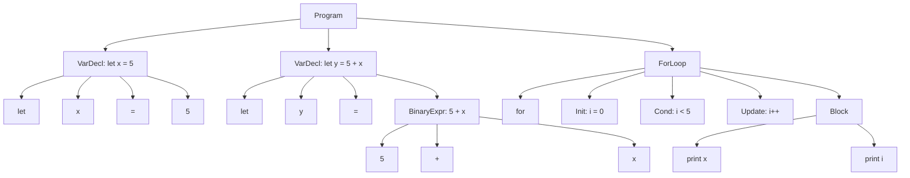

# Eidos Grammar (BNF Rules)

Now that the Lexer is done, it is time to write the grammar rules. \
These rules dictate how the language is typed, i.e. what tokens/lexemes go before/after these ones, etc, etc. \
This creates the syntax of the language. 

This is a great segmant of what Eidos really is

## 1.1 What is the goal of Eidos Grammar

For Eidos v1.0.0 it should remain simple and nothing crazy and then evolve, as mentioned in the `README`, simple now, grow in complexity but chill after a bit of development. 


## 1.1 Basic Grammar (High Level Look)

Given this example code written in Eidos: 

```bash
let x = 5;
let y = 5 + x;

for (i = 0; i < 5; i++) {
    print(x);
    print(i);
}
```

After passing through the lexer we build the AST using a Syntax Parser built off some BNF Rules. Parsing this code would look like this:



