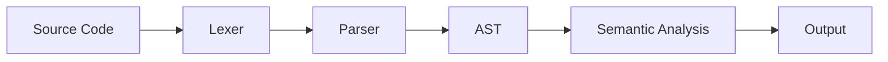

# Eidos

Eidos is a simple language and compiler aimed at deepening my knowledge in C and compiler design. Eidos is Greek for "Form" or "Essence." With this compiler, I aim to learn the essence and form of how we type code into an editor and run it through a compiler, which then transforms it into something the computer can execute.

## 1.1 Scope

As mentioned earlier, the scope of this project is to learn, not to create the next Rust or some fancy language. With that in mind, the language will start simple and grow over time, but nothing overly complex.

## Supported Features (For Now)

### Data Types
- `int`

NOTE: Only integer data types are used for now, later implementations will add more primitive ones such as char, bool, float, etc. String will probably happen much later.

### I/O Operations
- `print`
- `read`

NOTE: print() will only print variables or integer constants in the earliest versions. \
NOTE: read() will just accept the integer typed in and save it to a file, kind of works like this:

```bash
let x = read();
```

`read()` will take in an `integer` from `user` and save it to variable `x`

### Arithmetic Operators
`+` `-` `/` `*` `++` `--`

Simple computer arithmetic stuff, (Modulo %, later)

### Logical Comparisons
`<` `>` `<=` `>=` `==` `!=`

For your logical statements as needed

### Control Flow
- `if-else` statements
- `for` loops
- `while` loops

Basic ass control flow, standard stuff

## 1.2 Type

- Single Pass Compiler
- Core Compiler (not a full language implementation)
- Type checking soon enforced

## 1.3 Current Status

**Completed:**
- Lexer implementation with token classification
- Support for keywords: `print`, `read`, `for`, `let`, `while`
- Support for operators: `+`, `-`, `*`, `/`, `!`, `++`, `--`, `>`, `<`, `>=`, `<=`, `!=`, `=`, `==`
- Support for delimiters: `(`, `)`, `{`, `}`
- Integer literals and identifiers
- Lexeme building and token classification system

**In Progress:**
- 🔨 Parser development
- 🔨 AST construction

**Planned:**
- Semantic analysis
- Code generation

## 2.1 Core Architecture



## 3.1 Lexer

The lexer converts source code into tokens by scanning characters and building lexemes. The implementation follows a **scan → build → classify** pattern:

1. **Scan**: Read characters and determine lexeme boundaries
2. **Build**: Extract the lexeme string from source
3. **Classify**: Determine the appropriate token type

### Implementation Details

The lexer uses several helper functions:
- `peek()`: Look at the current character without consuming it
- `advance()`: Consume the current character and move to the next
- `build_lexeme()`: Extract lexeme string from start position to current position(Mostly for printing/logging)
- `classify_token()`: Map lexeme string to appropriate token type
- `make_token()`: Create token structure with lexeme, type, line, and column info

### Testing Lexer

Included in the repo are 
- `test_lexer.sh` &rarr; Shell script(written on macOS) for testing Lexer
- `test_codes` &rarr; Test Directory containing test dummy code
  - Nameing Convention: `test[0-9]_exit_code_0.e`
- `test_codes_lexemes` &rarr; Test Directory containing the expected output after running lexer
  - Nameing Convention: `test[0-9]_exit_code_0_output.e`

Testing the lexer will run 
1) Make
2) Run Lexer with src code file
3) Compare the output of lexer to the test outputs 
4) Save output to `/logs`

Testing directories right now only have passing tests, more to be added soon \
- Different Exit Codes
- Long Lexemes 
- Invalid IDENTIFERES + INT_LIT 

### Example:

```
let x = 10;
x++;
```

**Output:**
```
Lexeme: 'let', Token: KEYWORD_LET
Lexeme: 'x', Token: IDENTIFIER
Lexeme: '=', Token: ASSIGN_OP
Lexeme: '10', Token: INT_LIT
Lexeme: ';', Token: SEMICOLON
Lexeme: 'x', Token: IDENTIFIER
Lexeme: '++', Token: INC_OP
Lexeme: ';', Token: SEMICOLON
```

### 3.1.2 Keywords, Symbols, and Tokens

Below are the keywords, symbols, and their corresponding tokens:

**Keywords:**
```
print               KEYWORD_PRINT
read                KEYWORD_READ
for                 KEYWORD_FOR
while               KEYWORD_WHILE
let                 KEYWORD_LET
```

**Variables:**
```
x, abx, asd, counter    IDENTIFIER
1, 2, 23, 324           INT_LIT
```

**Operators:**
```
+                   PLUS_OP
-                   SUB_OP
/                   DIV_OP
*                   MULT_OP
!                   NOT_OP
++                  INC_OP
--                  DEC_OP
>                   GREATER_OP
<                   LESSER_OP
=                   ASSIGN_OP
<=                  LEQUAL_OP
>=                  GEQUAL_OP
==                  EQUAL_OP
!=                  NEQUAL_OP
```

**Delimiters:**
```
(                   LEFT_PAREN
)                   RIGHT_PAREN
{                   LEFT_CURL
}                   RIGHT_CURL
;                   SEMICOLON
```

## 3.1.3 Lexer Architecture

The Eidos lexer processes source code character-by-character and emits tokens. The lexer uses a **classification-based approach** where lexemes are first built, then classified into appropriate token types.

### Key Components:

1. **Lexer State**
   - Current position in source
   - Current line number
   - Current column number
   - Source code string

2. **Token Structure**
   - Token type (enum)
   - Lexeme string (dynamically allocated)
   - Line number
   - Column number

3. **Classification System**
   - Keywords are identified by string matching
   - Operators are recognized by character patterns
   - Identifiers start with letter or underscore
   - Integer literals are sequences of digits

### Processing Flow:

```
Source Code
    ↓
Skip Whitespace
    ↓
Identify Character Type
    ↓
Build Lexeme (scan until boundary)
    ↓
Classify Token Type
    ↓
Create Token Structure
    ↓
Return Token
```

## 4.1 Abstract Syntax Tree (AST)

The AST is a tree representation of the syntactic structure of source code. Each node in the tree represents a construct in the language. The parser builds the AST from tokens provided by the lexer.

### AST Node Types

The AST uses a **tagged union** design where each node has a type and type-specific data:

#### Program Structure
- `AST_PROGRAM_NODE` - Root node containing all statements
- `AST_STMTS_NODE` - Linked list of statement nodes

#### Statement Nodes
- `AST_VAR_DECL_NODE` - Variable declarations: `let x = 5;`
- `AST_ASSIGN_NODE` - Assignments: `x = 10;`
- `AST_IF_STMT_NODE` - If-else conditionals with optional else block
- `AST_FOR_LOOP_NODE` - For loops with initializer, condition, step, and body
- `AST_WHILE_LOOP_NODE` - While loops with condition and body
- `AST_PRINT_NODE` - Print statements
- `AST_READ_NODE` - Read statements for user input

#### Expression Nodes
- `AST_BINARY_EXPR` - Binary operations: `a + b`, `x * y`
- `AST_COMPARISON_NODE` - Comparisons: `x >= 3`, `a == b`
- `AST_UNARY_EXPR` - Unary operations: `++x`, `--a`, `-x`, `!flag`
- `AST_IDENTIFIER` - Variable references
- `AST_INT_LIT` - Integer literals

### AST Design Principles

1. **Type Safety**: Each node type has specific fields relevant to that construct
2. **Memory Efficiency**: Uses union to minimize memory footprint
3. **Recursive Structure**: Nodes can contain pointers to other nodes
4. **Linked Lists**: Statements are connected via `next` pointers

### Example AST Structure

For the code:
```c
let x = 5;
x++;
print(x);
```

The AST structure would be:
```
AST_PROGRAM_NODE
  └─ AST_STMTS_NODE
       ├─ AST_VAR_DECL_NODE (identifier: "x", value: AST_INT_LIT(5))
       │    └─ next
       ├─ AST_UNARY_EXPR (op: "++", operand: AST_IDENTIFIER("x"), is_prefix: 0)
       │    └─ next
       └─ AST_PRINT_NODE (expression: AST_IDENTIFIER("x"))
            └─ next (NULL)
```

### Unary Expression Handling

The `AST_UNARY_EXPR` node handles all unary operations with an `is_prefix` flag:
- **Prefix**: `++x`, `--x`, `-x`, `!flag` (is_prefix = 1)
- **Postfix**: `x++`, `x--` (is_prefix = 0)

This distinction is important for semantic analysis and code generation, as prefix and postfix increment/decrement have different evaluation semantics.

### Memory Management

- Parser owns token lexemes during parsing
- AST nodes are dynamically allocated
- Linked list structure allows efficient sequential processing
- All memory freed via recursive AST traversal after compilation