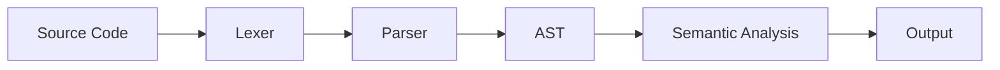
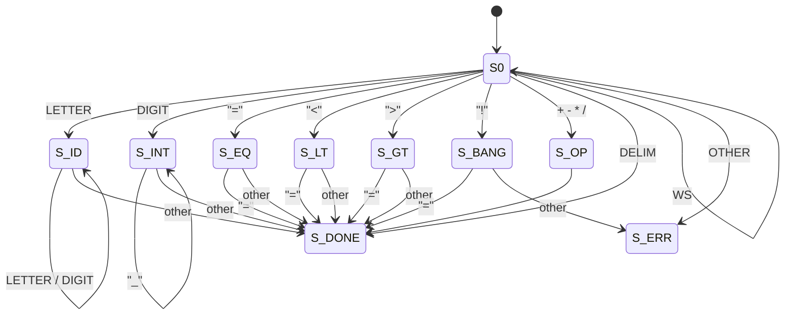

# Eidos

Eidos is a simple language and compiler aimed at deepening my knowledge in C++ and data structures & algorithms. Eidos is Greek for "Form" or "Essence." With this compiler, I aim to learn the essence and form of how we type code into an editor and run it through a compiler, which then transforms it into something the computer can execute.

## 1.1 Scope

As mentioned earlier, the scope of this project is to learn, not to create the next Rust or some fancy language. With that in mind, the language will start simple and grow over time, but nothing overly complex.

## 1.2 Type

- Single Pass Compiler
- Core Compiler (not a full language implementation)
- Type checking enforced (only INT variables for now)

## 2.1 Core Architecture



## 3.1 Lexer

The lexer has a simple job: convert source code into lexemes and tokens.

### Example:

```
let x: int = 10;
let y: int = x * 3;
if (y > 15) {
    print(y)
}
```

### 3.1.2 Keywords, Symbols, and Tokens

Below are the keywords, symbols, and their corresponding tokens:

**Keywords:**
```
print               KEYWORD_PRINT
read                KEYWORD_READ
if                  KEYWORD_IF
while               KEYWORD_WHILE
for                 KEYWORD_FOR
int                 KEYWORD_INT
let                 KEYWORD_LET
```

**Variables:**
```
x, abx, asd, counter    IDENTIFIER
1, 2, 23_324            INT_LIT
```

**Operators:**
```
+                   PLUS_OP
-                   MINUS_OP
/                   DIV_OP
*                   MULT_OP
>                   GREATER_OP
<                   LESSER_OP
=                   ASSIGN_OP
<=                  LEQUAL_OP
>=                  GEQUAL_OP
==                  EQUAL_OP
!=                  NEQUAL_OP
```

**Delimiters:**
```
(                   LPAREN
)                   RPAREN
{                   LBRACE
}                   RBRACE
:                   COLON
;                   SEMICOLON
```

## 3.1.3 Deterministic Finite State Automaton (DFA)

The Eidos lexer is implemented as a **Deterministic Finite State Automaton (DFA)**.  
The DFA processes the source code character-by-character and emits tokens when an accepting state is reached.

Formally, the lexer DFA is defined as:

**DFA = (Q, Σ, δ, q0, F)**

Where:
- **Q** is the finite set of states
- **Σ** is the input alphabet
- **δ** is the transition function
- **q0** is the start state
- **F** is the set of accepting states

---

### DFA States (Q)

```
S0          Start state
S_ID        Identifier or keyword
S_INT       Integer literal
S_OP        Single-character operator
S_EQ        '=' seen (assignment or equality)
S_LT        '<' seen (less-than or less-equal)
S_GT        '>' seen (greater-than or greater-equal)
S_BANG      '!' seen (not-equal)
S_DONE      Accepting state
S_ERR       Error state
```

---

### Input Alphabet (Σ)

Characters are grouped into the following classes:

| Class   | Characters |
|---------|------------|
| LETTER  | a–z, A–Z, _ |
| DIGIT   | 0–9 |
| WS      | space, tab, newline |
| OP      | + - * / = < > ! |
| DELIM   | ( ) { } : ; |
| OTHER   | any invalid character |

---

### Transition Function (δ)

#### Start State (`S0`)

| Input       | Next State |
|-------------|------------|
| LETTER      | S_ID |
| DIGIT       | S_INT |
| '='         | S_EQ |
| '<'         | S_LT |
| '>'         | S_GT |
| '!'         | S_BANG |
| + - * /     | S_OP |
| DELIM       | S_DONE |
| WS          | S0 (skip) |
| OTHER       | S_ERR |

---

#### Identifier / Keyword State (`S_ID`)

| Input            | Next State |
|------------------|------------|
| LETTER or DIGIT  | S_ID |
| otherwise        | S_DONE (retract one character) |

---

#### Integer Literal State (`S_INT`)

| Input          | Next State |
|----------------|------------|
| DIGIT          | S_INT |
| '_' (optional) | S_INT |
| otherwise      | S_DONE (retract one character) |

---

#### Operator States

##### Assignment / Equality (`S_EQ`)

| Input     | Result |
|-----------|--------|
| '='       | Emit `EQUAL_OP` |
| otherwise | Emit `ASSIGN_OP` (retract) |

---

##### Less-than (`S_LT`)

| Input     | Result |
|-----------|--------|
| '='       | Emit `LEQUAL_OP` |
| otherwise | Emit `LESSER_OP` (retract) |

---

##### Greater-than (`S_GT`)

| Input     | Result |
|-----------|--------|
| '='       | Emit `GEQUAL_OP` |
| otherwise | Emit `GREATER_OP` (retract) |

---

##### Not-equal (`S_BANG`)

| Input     | Result |
|-----------|--------|
| '='       | Emit `NEQUAL_OP` |
| otherwise | Lexer error (`'!'` is invalid alone) |

---

### Accepting States (F)

The following states are accepting and emit tokens:

- `S_ID` → `IDENTIFIER` or `KEYWORD_*` (via keyword lookup)
- `S_INT` → `INT_LIT`
- `S_OP` → arithmetic operator tokens
- `S_EQ`, `S_LT`, `S_GT`, `S_BANG` → relational operator tokens
- `S_DONE` → delimiter tokens

Keyword resolution is performed **after** reaching `S_ID` by matching the lexeme against the keyword table.


### Visual

